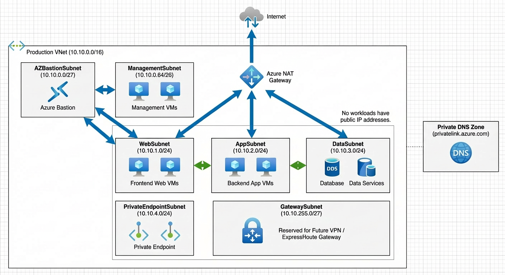

# Azure Network Foundation

## Overview
This project demonstrates the design and implementation of a foundational Azure network using best practices.
It focuses on secure network segmentation, controlled traffic flows, and cost-aware deployment.

## Architecture

## Network Design
- Azure Virtual Network: 10.10.0.0/16
- Subnets designed using VLSM
- No public IP addresses on workloads
- Network Security Groups applied per subnet

## Security
- Least-privilege access model
- Default deny inbound and outbound rules
- Explicitly allowed traffic between layers

## Cost Awareness
The implementation was divided into phases to avoid deploying hourly-billed resources during the foundation stage.

## Documentation
- [NSG Design](docs/nsg-design.md)

## Status
Foundation completed. No compute or gateway resources deployed.
